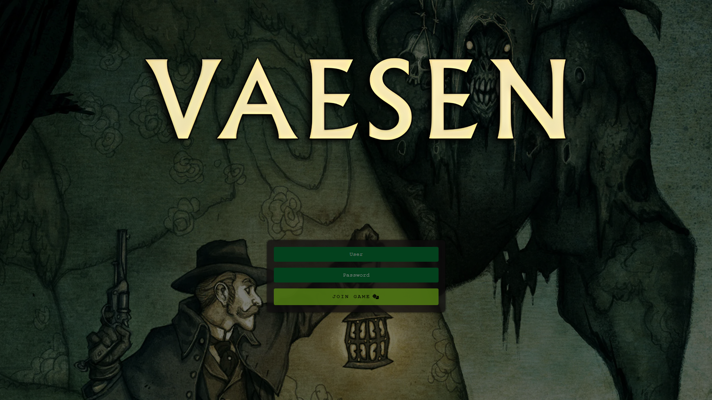

# Credits
* Vaesen
1. Background and logo are taken from [Free League Publishing](https://freeleaguepublishing.com/) ([Website](https://freeleaguepublishing.com/games/vaesen/) and/or [Rulebooks](https://freeleaguepublishing.com/shop/vaesen-2/vaesen-nordic-horror-roleplaying/)).

* Tales From The Loop 
1. Background is taken from The Electric State book from Simon Stålenhag.
2. Logo is taken from Free League Publishing (Website and/or Rulebooks).

* Dungeons & Dragons background and logo are aken from Wizards of the Coast (Website and/or Rulebooks).

About artworks:
* I don't own any pictures shown here.
* I will remove them if I violate any laws and/or intellectual property. Ask me in the Issues tab of the project.