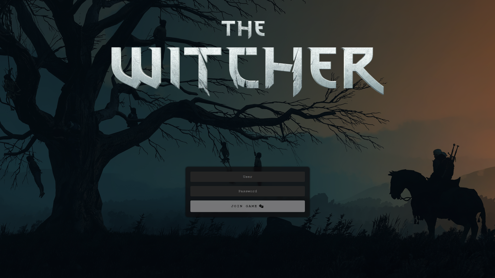

# Summary
Hello there,<br>
This small css package aims to enhance and beautify the default log-in screen of the famous roleplaying platform [FoundryVTT](https://foundryvtt.com/).
Below you'll find everything you need to use the package.

# Results
### <p align="center">Vaesen</p>
<br>
### <p align="center">Tales From The Loop</p>
<br>
### <p align="center">Dungeons & Dragons</p>
<br>
### <p align="center">The Witcher</p>
<br>

# Requirements
* A minimal resolution of 870px by 500px (shouldn't be an issue as Foundry requires 1024px by 700px to work).
* An access to your Foundry instance to modify files.

# Deployment
* OPTIONAL: Update your world's background (using the *Administrator Setup*).
* Upload your world logo in your FoundryVTT instance.
    * I advise you to use the *Administrator Setup* in the same way as if you were updating the world's background WITHOUT clicking on *Update World*. This will upload the file in the root directory of your FoundryVTT instance.
* Overwrite your ```$foundry_path/resources/app/templates/setup/join-game.hbs``` with .
* Concatenate your ```$foundry_path/resources/app/public/css/foundry2.css``` with (for example) .
* Don't forget to configure your updated CSS in the *Configuration Area*.

# Known bugs
* If you upgrade your instance of FoundryVTT, you'll loose everything related to this package (backups are your friends).
* Some drop-down buttons have their style changed in the *Administrator Setup* (only seen in "Application Configuration" and "Update"; this will not impact game sessions).
* The H1 title (usually "FoundryVTT") shown in *Administrator Setup* is hidden (this will not impact game sessions).

# Credits
### <p align="center">*I do not own any logos and/or backgrounds shown here. I will remove them if I violate any laws and/or intellectual property. Ask me in the [Issues](https://github.com/Doluprane/foundryvtt-login-pages/issues) tab of the project.<br>I am not affiliated with any brands shown in this GitHub repository.*</p>
This is more or less a fork from https://github.com/dandln/Foundry-VTT-Prettier-Login-Screen based on a code of [u/bass-blowfish](https://www.reddit.com/user/bass-blowfish/)<br>

* Vaesen
    * Background and logo are taken from [Free League Publishing](https://freeleaguepublishing.com/) ([Website](https://freeleaguepublishing.com/games/vaesen/) and/or [Rulebooks](https://freeleaguepublishing.com/shop/vaesen-2/vaesen-nordic-horror-roleplaying/)).

* Tales From The Loop 
    * Background is taken from The Electric State book from Simon Stålenhag.
    * Logo is taken from [Free League Publishing](https://freeleaguepublishing.com/) ([Website](https://freeleaguepublishing.com/games/tales-from-the-loop-rpg/) and/or [Rulebooks](https://freeleaguepublishing.com/shop/tales-from-the-loop/core-rulebook/)).

* Dungeons & Dragons
    * Background and logo are taken from [Wizards of the Coast](https://company.wizards.com/) ([Website](https://dnd.wizards.com/) and/or [Rulebooks](https://marketplace.dndbeyond.com/category/dungeon-masters-guide/)).

* The Witcher
    * Background is taken from [Wallhere](https://wallhere.com/en/wallpaper/1931009/) from [CelenaHehr](https://wallhere.com/en/user/3600649/).
    * Logo is taken from [CD Projekt RED](https://www.cdprojektred.com/) ([Website](https://www.thewitcher.com/)).