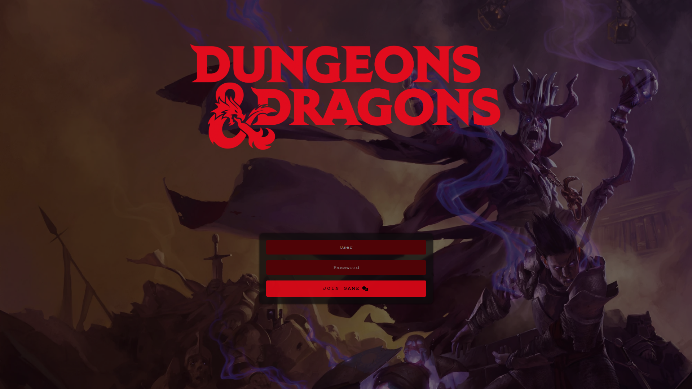

# Table of Contents
[Results](#results)

<a name="results"># Results</a>
### 
Vaesen

 
### 
Tales From The Loop

 
### 
Dungeons & Dragons

 
### 
The Witcher

 

# Requirements
* A minimal resolution of 870px by 500px (shouldn't be an issue as Foundry requires 1024px by 700px to work).
* An access to your Foundry instance to modify files.

# Deployment

# Credits
### 
*I do not own any logos and/or backgrounds shown here. I will remove them if I violate any laws and/or intellectual property. Ask me in the [Issues](https://github.com/Doluprane/foundryvtt-login-pages/issues) tab of the project.*

* Vaesen
    * Background and logo are taken from [Free League Publishing](https://freeleaguepublishing.com/) ([Website](https://freeleaguepublishing.com/games/vaesen/) and/or [Rulebooks](https://freeleaguepublishing.com/shop/vaesen-2/vaesen-nordic-horror-roleplaying/)).

* Tales From The Loop 
    * Background is taken from The Electric State book from Simon Stålenhag.
    * Logo is taken from [Free League Publishing](https://freeleaguepublishing.com/) ([Website](https://freeleaguepublishing.com/games/tales-from-the-loop-rpg/) and/or [Rulebooks](https://freeleaguepublishing.com/shop/tales-from-the-loop/core-rulebook/)).

* Dungeons & Dragons
    * Background and logo are taken from [Wizards of the Coast](https://company.wizards.com/) ([Website](https://dnd.wizards.com/) and/or [Rulebooks](https://marketplace.dndbeyond.com/category/dungeon-masters-guide/)).

* The Witcher
    * Background is taken from [Wallhere](https://wallhere.com/en/wallpaper/1931009/) from [CelenaHehr](https://wallhere.com/en/user/3600649/).
    * Logo is taken from [CD Projekt RED](https://www.cdprojektred.com/) ([Website](https://www.thewitcher.com/)).